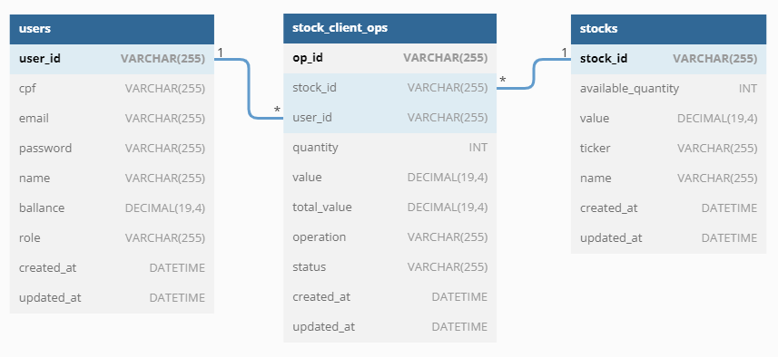

# Desafio Técnico XP Inc

Desafio técnico realizado em Julho/22 para BackEnd no processo seletivo da XP Inc. focado na turma XP da Trybe.

Breve descrição:
Desenvolver uma aplicação que se assemelha ao nosso dia a dia, um aplicativo de investimento em ações, com algumas funcionalidades de conta digital.

As entidades que implementei foram:
- Users => gerencia os usuários, cadastros, login, delete, update;
- Stocks => gerencia as ações, cadastro, busca de todas ações, busca por ID.
- StocksOps => gerencia todas as compras e vendas de ações.


## Apêndice

Realizei o projeto em Nodejs, utilizando a estrutura de Model / Service / Controller.

Neste desafio técnico optei por não realizar nenhuma validação nos CPFs informados no momento do cadastro de uma nova pessoa usuária. Desta forma não é necessário informar um CPF real. 

Fiz os testes utilizando o Mocha, Chai e Sinon e optei por testar as três camadas da entidade User.

Para a entidade User implementei os 4 verbos do CRUD, apesar de não ter sido solicitado no desafio.

Utilizei o JWT para validação e controle de tempo de sessão da pessoa usuária.

## Diagrama de Entidades e Relacionamentos



Obs: a coluna "status" na tabela stock_client_ops não foi implementada, mas o objetivo dela é informar se a operação (compra ou venda), foi realizada com sucesso, cancelada ou rejeitada.

## Implementações extras:

Fiz algumas implementações extras e pequenas alterações nas rotas solicitadas. As rotas solicitadas (requisitos mínimos) foram:
- investimentos/comprar (POST)
- investimentos/vender (POST)
- /ativos/{cod-cliente} (GET) => wallet
- /conta/deposito (POST)
- /conta/saque (POST)
- /conta/{cod-cliente} (GET) => saldo em conta

Modificações em relações as rotas propostas:
- /ativos/{cod-cliente} (GET) => wallet ===> /investimentos/{cod-cliente}
- /conta/deposito (POST) ===> /users/conta/deposito
- /conta/saque (POST) ===> /users/conta/saque
- /conta/{cod-cliente} (GET) => saldo em conta ===> /users/conta/saldo

Além das rotas acima, implementei as seguintes rotas:
- /login
- /investimentos => todas as operações de todas as pessoas usuárias (requer admin)
- /investimentos/{cod-cliente} => todas as operações da pessoa logada
- /ativos (GET) => todos os ativos cadastrados no banco (requer admin)
- /ativos (POST) => criação de nova ação no bd
- /ativos/{cod-ativo} => recupera todas as informações do ativo (inclusve qtd disponível para negociação)
- /users (GET) => todos os usuários disponíveis no bd (requer admin)
- /users (POST) => cria um novo usuário
- /users/{cod-cliente} (GET) => dados do usuário logado
- /users (DELETE) => deleta um usuário (requer admin)
- /users/{cod-cliente} (PUT) => atualiza informações do usuário

O desafio solicitava os ID's como integers, porém optei por utilizar o UUID V4 para gerar os ID's. A escolha foi por entender que desta forma a sequência de ID's será protegida, a chance de que ocorra uma duplicação de ID's é muito baixa conforme pesquisei.

## Regras de Negócio

Login:
- O usuário deve ser cadastrado no banco de dados;
- O usuário deve ser autenticado no banco de dados com login e senha;

Admin:
- O usuário deve ser cadastrado no banco de dados;
- O usuário deve ser autenticado no banco de dados com login e senha;
- O usuário deve ser um usuário administrador com o campo role = admin;

Criação de nova pessoa usuária:
- O nome deve ter no mínimo 3 caracteres;
- O Email deve ter um formato válido;
- A senha deve ter no mínimo 8 caracteres, um caracter especial e um número.
- O saldo deve ser maior ou igual a 0;

Criação de nova ação:
- O nome deve ter no mínimo 3 caracteres;
- A quantidade disponível deve ser maior ou igual a 0;
- O valor da ação deve ser maior ou igual a 0;

Venda de ação:
- Deve ser informada uma operação com o ID (existente) da ação e a quantidade desejada de ser vendida;
- A quantidade deve ser maior ou igual a 0;
- A pessoa usuária logada deve possuir a quantidade de ações disponíveis para venda em sua carteira;

Compra de ação:
- Deve ser informada uma operação com o ID (existente) da ação e a quantidade desejada de ser comprada;
- A quantidade deve ser maior ou igual a 0;
- A pessoa usuária logada deve possuir em sua carteira a ação e a quantidade informada na operação de venda;

## Documentação da API

A documentação da API foi realizada utilizando o Swagger e pode ser acessada neste [endereço](https://desafioxp.herokuapp.com/docs).

Para fins de avaliação, algumas rotas privadas e acesso admin foram disponibilizados de forma pública no Swagger.

Também disponibilizei na pasta `docs` a collection do Postman.

Swagger:


## Rodando localmente

Clone o projeto

```bash
  git clone git@github.com:paolofullone/desafioXP.git
```

Entre no diretório do projeto:

```bash
  cd desafioXP
```

Instale as dependências:

```bash
  npm install
```

**Crie o arquivo dotenv conforme .env.example (ou seção "Variáveis de Ambiente")**

Inicie o servidor utilizando o docker compose:

```bash
  docker-compose up -d
```

Veja os logs da aplicação acessando os logs do docker:

```bash
  npm run dockerlogs
```
## Rodando os testes

Para rodar os testes, execute o seguinte comando:

```bash
  npm run test:coverage
```
Tabela de cobertura dos testes:


## Deploy

O deploy deste projeto foi realizado no [Heroku](https://desafioxp.herokuapp.com/). 

Utilizei CI/CD com a Dockerfile e main.yml do Github e configurações adicionais no Heroku (como a opção de somente realizar o deploy se a avaliação do ES Lint for aprovada).

Configurações do Heroku:


Diagrama gerado no [https://dbdiagram.io/](https://dbdiagram.io/)

## Stack utilizada

**Back-end:** Node, Express, Docker, Docker-Compose, JWT, MySQL, Swagger, Swagger-jsdoc.

**Testes:** Mocha, chai, sinon.

## Aprendizados

Durante a primeira etapa deste projeto, abri o home brooker da XP de uma forma diferente, buscando entender como cada parte funcionava do ponto de vista de código.

Minha primeira grande dificuldade foi modelar o banco de dados (e remodelei algumas vezes, talvez mais de uma dezenha de vezes). Detalhes como qual tipo de dado devo utilizar para os campos de saldo, preço etc nunca havia pesquisado. Pensar nas regras de negócio, como impactavam no banco etc.

As validações também foram desenvolvidas ao londo de toda a aplicação e sempre pensava em algum detalhe que poderia melhorar ao longo do desenvolvimento.

Ao elaborar os testes e ao elaborar a documentação em Swagger, o efeito colateral foram diversas refatorações do código.

## Melhorias Futuras

Além das funcionalidades extras que implementei, poderia implementar uma criptografia dos dados de senhas, como o bcrypt por exemplo.

Aplicação de todos os verbos do CRUD para todas as entidades.

## Débito Técnico

Implementação de Transaction e Rollback nas funções SQL que alteram mais de uma tabela em somente uma transação.

## Variáveis de Ambiente

Para rodar esse projeto, você vai precisar adicionar as seguintes variáveis de ambiente no seu .env

`MYSQL_HOST`
`MYSQL_USER`
`MYSQL_PASWORD`
`MYSQL_DATABASE`
`PORT`
`JWT_SECRET`

## Feedback

Se você tiver algum feedback, dúvida ou sugestão, entre em contato via linkedin e ficarei muito grato.


## Autor

- [Paolo Fullone](https://www.github.com/in/paolofullone)

